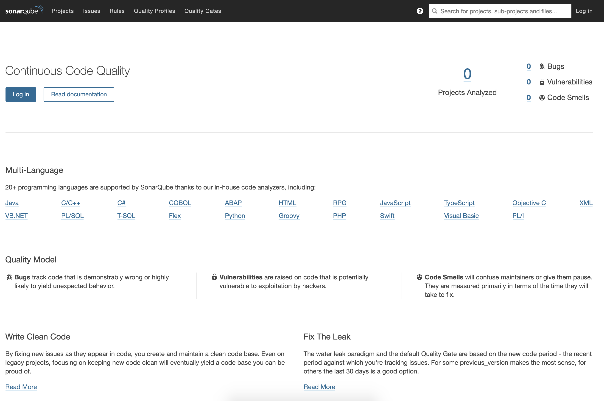

# SonarQube Terraform AWS Module

[SonarQube][] is a tool for static code analysis.

The [EC2 with Autoscaling and Load Balancing Terraform Module][] was used to create the stack. The module creates the follwoing resources:

1. Launch template that creates a server using the specified AMI filter.
1. EC2 autoscaling group that uses the launch template to spin up the server.
1. Load balancer that points dynamically to the EC2 server.

The AMI that has the SonarQube server pre-installed was used. It was created using the [SonarQube Packer for AWS AMI][] project. The SonarQube AMI has the following pre-installed:

1. MySQL 5.7
1. SonarQube 7.4



## Features

1. The server is recreated in the event that it is terminated.
1. Load balancing is dynamic and automatically points to the newly-created server.

## Usage

To create the server, you'll first need to create your own SonarQube AMI. You can use the Packer AMI project referenced above.

```terraform
module "sonarqube" {
  source = "git::https://github.com/yegorski/terraform-aws-sonarqube.git"

  region = "us-east-1"

  # EC2
  ami_owner     = "${var.aws_account_id}"
  ami_filter    = "Amazon Linux 2 SonarQube AMI*"
  instance_type = "c5.large"
  ssh_ip        = "${var.ssh_ip}"
  ssh_key_name  = "yegorski"

  # Network
  is_internal = false
  subnet_ids  = "${var.subnet_ids}"
  vpc_id      = "${var.vpc_id}"

  tags = {
    Owner       = "yegorski"
    Environment = "production"
    Source      = "https://github.com/yegorski/terraform-aws-sonarqube"
  }
}
```

## Inputs

| Name                        | Description                                                                          | Type   | Default                        | Required |
| --------------------------- | ------------------------------------------------------------------------------------ | ------ | ------------------------------ | :------: |
| region                      | The AWS region.                                                                      | string | `"us-east-1"`                  |   yes    |
| tags                        | A map of tags to apply to all AWS resources.                                         | map    |                                |   yes    |
| ssh_key_name                | The name of the SSH key to use for the launched instances.                           | string |                                |   yes    |
| subnet_ids                  | Subnet IDs for server and load balancer.                                             | list   |                                |   yes    |
| vpc_id                      | The VPC ID to launch resources in.                                                   | string |                                |   yes    |
| ami_filter                  | Filter to obtain the Amazon Marketplace Image to use for the server.                 | string | `"amzn2-ami-hvm-*-x86_64-gp2"` |    no    |
| ami_owner                   | Owner of the AMI to use for the server. Used to look for the AMI on the marketplace. | string | `"amazon"`                     |    no    |
| associate_public_ip_address | Boolean to control whether to create a public IP address for the server.             | string | `false`                        |    no    |
| instance_type               | EC2 instance size.                                                                   | string | `c5.large`                     |    no    |
| ssh_ip                      | Specify IP address to allow SSH access to the EC2 instace (such as your IP).         | string | `""` (no SSH access).          |    no    |
| volume_size                 | The size of the EBS volume for the server.                                           | string | `50` (GB).                     |    no    |
| alb_certificate_arn         | The ARN of the ALB certificate to attach to the load balancer.                       | string | `""` (no SSL).                 |    no    |
| is_internal                 | Boolean to control whether the load balancer is interal.                             | string | `true`                         |    no    |

## Outputs

| Name        | Description                                                                                          |
| ----------- | ---------------------------------------------------------------------------------------------------- |
| lb_dns_name | Load balancer URL.                                                                                   |
| lb_zone_id  | Load balancer DNS zone ID. Can be used to create a friedly DNS record to point to the load balancer. |

## Testing

The Terraform in this project is tested with [Terratest][]. Terratest is used to:

1. Deploy the module
1. Validate that SonarQube is responding by querying the ALB
1. Tear down the resources

See `test/packer_sonarqube_test.go`.

[ec2 with autoscaling and load balancing terraform module]: https://github.com/yegorski/terraform-aws-autoscaling-e2
[sonarqube]: https://www.sonarqube.org/
[sonarqube packer for aws ami]: https://github.com/yegorski/packer-aws-sonarqube
[terratest]: https://github.com/gruntwork-io/terratest
